##  What am I talking about?

:::::::::: columns
::::: {.column width="44%"}
**Aims**

::: incremental
-    Introduce the concepts, the dangers and the opportunities
-    Learn something new
-    Give the panel afterwards something to argue about
:::
:::::

:::::: {.column width="52%"}
::::: {.panel .fragment .fade-up style="font-size: 0.85em"}
 **Understand**

1.  What is an LLM?
2.  LLMs as a bioinformatician's tool

::: {.fragment .fade-up}
 **Use**

3.  Prompting as a research skill
4.  Which model should I use?
5.  Agentic AI
:::

::: {.fragment .fade-up}
 **Be careful**

6.  How it goes wrong
7.  Take homes, and where this is going
:::
:::::
::::::
::::::::::

# 1. What is an LLM? {background-gradient="linear-gradient(to bottom, #25717D 0%, #25717D 85%, #FFFFFF 85%, #FFFFFF 100%)"}

##  How it works

When we say LLM today, we usually mean a large language model that generates text.

```{=html}
<div class="gen-flow">
  <div class="gf-head">Your text</div>
  <div class="gf-arrow"><i class="fa-solid fa-arrow-right"></i></div>
  <div class="gf-head">tokens</div>
  <div class="gf-arrow"><i class="fa-solid fa-arrow-right"></i></div>
  <div class="gf-head"><span class="gf-model">the model</span></div>
  <div class="gf-arrow"><i class="fa-solid fa-arrow-right"></i></div>
  <div class="gf-head">next-token odds</div>
  <div class="gf-arrow"><i class="fa-solid fa-arrow-right"></i></div>
  <div class="gf-head">pick one</div>

  <div class="gf-ex fragment" data-fragment-index="1">“My favourite programming language is”</div>
  <div class="gf-ex fragment" data-fragment-index="1"></div>
  <div class="gf-ex fragment" data-fragment-index="1"><span class="gf-tok">My</span><span class="gf-tok">favourite</span><span class="gf-tok">programming</span><span class="gf-tok">language</span><span class="gf-tok">is</span></div>
  <div class="gf-ex fragment" data-fragment-index="1"></div>
  <div class="gf-ex fragment" data-fragment-index="1"></div>
  <div class="gf-ex fragment" data-fragment-index="1"></div>
  <div class="gf-ex fragment" data-fragment-index="1">
    <div class="gf-odds picked"><span>R</span><b style="width: 46%"></b><em>46%</em></div>
    <div class="gf-odds"><span>Python</span><b style="width: 31%"></b><em>31%</em></div>
    <div class="gf-odds"><span>Rust</span><b style="width: 8%"></b><em>8%</em></div>
    <div class="gf-odds"><span>Julia</span><b style="width: 4%"></b><em>4%</em></div>
  </div>
  <div class="gf-ex fragment" data-fragment-index="1"></div>
  <div class="gf-ex fragment" data-fragment-index="1"><span class="gf-tok picked">R</span><div class="gf-note">Usually the top one, but chance is a setting</div></div>
</div>

<div class="gf-repeat fragment" data-fragment-index="2"><i class="fa-solid fa-rotate-left"></i> append it, and repeat: “My favourite programming language is <b>R</b>” …</div>
```

::: {.fragment fragment-index="3"}
Trained on text and code up to a cut-off date. Facts emerge from the patterns.
:::

::: {.big .fragment fragment-index="4"}
It isn't a database. When it doesn't know, it may still write something that sounds right.
:::

##  Instruction tuning

A pretrained model **continues text**. Answering a question is a behaviour that has to be trained in.

Instruction tuning and preference training turn *continue this document* into *do what I asked*.

::: incremental
-   Helpfulness comes from this step
-   So does agreeableness - "You are right to push back on that ..."
-   A model trained to please people learns what people approve of, not necessarily what is true.
:::

::: {.big .fragment}
It may agree with you even when you're wrong!
:::

##  Reasoning and tools

Improving the answer

::::::: columns
:::: {.column width="48%"}
::: panel
 **Reasoning**

Write out working before answering. More thinking ≠ more knowledge
:::
::::

:::: {.column width="48%"}
::: {.panel .fragment}
 **Tools**

Give the model access to information or computation it doesn't have internally.

A database, web search or your own documents, R/python.

The answer comes out of the tool not the model's knowledge
:::
::::
:::::::

::: fragment
Tools have made LLMs much more useful in bioinformatics.
:::

##  Demo — the same question, with and without tools

:::: term-window
::: term-bar
 **R console** · ellmer · qwen3:0.6b running locally in Ollama
:::

```{=html}
<div id="ellmer-cast" class="term"></div>
```
::::

::: {#ellmer-intro .term-question .term-intro}
[×]{.term-close title="Close"}

The same question, asked with and without a tool.

<small>An R function sends the prompt to a model running locally on this laptop.</small>
:::

::: {#ellmer-question .term-question}
Is this right?

<small>Press play to ask again, this time with a tool</small>
:::

```{r}
#| echo: false
#| eval: true
#| results: asis
cat("```{=html}\n<script type=\"text/plain\" id=\"ellmer-cast-data\">\n")
cat(readLines("recordings/ellmer-demo.cast"), sep = "\n")
cat("</script>\n```\n")
```

```{=html}
<link rel="stylesheet" href="https://cdn.jsdelivr.net/npm/asciinema-player@3.17.0/dist/bundle/asciinema-player.css">
<script src="https://cdn.jsdelivr.net/npm/asciinema-player@3.17.0/dist/bundle/asciinema-player.min.js"></script>
<script>
window.addEventListener("load", function () {
  var holder = document.getElementById("ellmer-cast");
  var question = document.getElementById("ellmer-question");
  var intro = document.getElementById("ellmer-intro");
  var slide = holder.closest("section");
  var player;

  function onSlide() {
    if (Reveal.getCurrentSlide() !== slide) {
      if (player) player.pause();
      return;
    }
    if (!player) {
      var cast = document.getElementById("ellmer-cast-data").textContent.trim();
      player = AsciinemaPlayer.create({ data: cast }, holder, {
        fit: "both",
        idleTimeLimit: 3,
        pauseOnMarkers: true,
        controls: true
      });
      // The intro only belongs to the first run, so the run with the tool
      // keeps the terminal clear
      var asked = false;
      player.addEventListener("marker", function () {
        asked = true;
        question.classList.add("shown");
        intro.classList.remove("shown");
      });
      player.addEventListener("play", function () {
        question.classList.remove("shown");
        if (!asked) intro.classList.add("shown");
      });
      intro.querySelector(".term-close").addEventListener("click", function () {
        intro.classList.remove("shown");
      });
    }
    player.play();
  }

  Reveal.on("slidechanged", onSlide);
  onSlide();
});
</script>
```

::: {.fragment .term-answer}
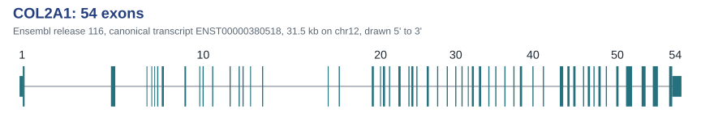{.nolightbox}
:::

##  What made the difference

```{r}
#| echo: false
#| eval: true
#| results: asis
cat('```r\n')
cat(sub("^  ", "", readLines("demos/03-tool-calling.R")[21:25]), sep = "\n")
cat('\n```\n')
```

::: term-hint
From `demos/03-tool-calling.R` — hover to copy
:::

# 2. LLMs as a bioinformatician's tool {background-gradient="linear-gradient(to bottom, #25717D 0%, #25717D 85%, #FFFFFF 85%, #FFFFFF 100%)"}

##  What can we use them for? {.table-compact}

|   |   | Looks like |
|------------------------|------------------------|------------------------|
|  | **Understand** | What does this inherited Perl script do? What does this error mean? Other terms a paper might use |
|  | **Generate** | sbatch scripts, a plotting function, documentation for code that already works |
|  | **Transform** | R to Python, notes into slides |
|  | **Review** | Why is this loop slow? |
|  | **Use tools** | Install the software, run it, read the traceback, fix it, run it again |

: {tbl-colwidths="\[5,15,80\]"}

::: fragment
*decide* is deliberately missing!
:::

::: {.big .fragment}
They work best when **you can tell immediately whether it worked**.
:::

##  LLMs are now integrated in many tools: MultiQC

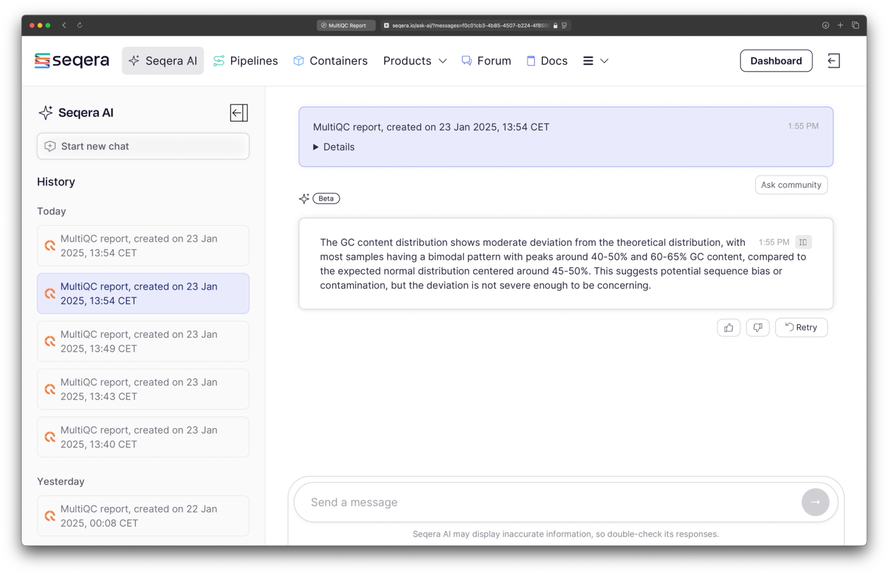{.r-stretch fig-align="center"}

The LLM doesn't have to be a separate chat box. It can sit inside the tools you already use.

::: cite
Seqera (2025) *[AI Summaries now available in MultiQC](https://seqera.io/blog/ai-summaries-multiqc/){target="_blank"}*
:::

##  Asking an LLM to annotate cells: impressive, but…

::::::: columns
::: {.column width="52%"}
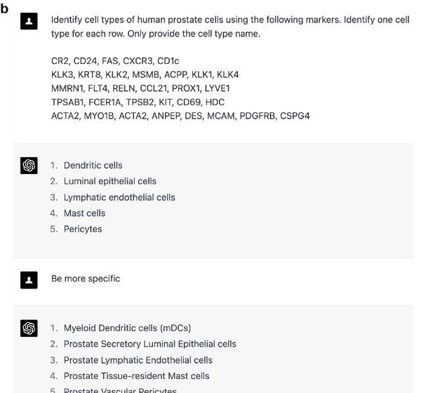{style="max-height: 350px;"}

[Would you know which clusters it got wrong?]{.big .fragment fragment-index="2"}
:::

::::: {.column .fragment width="44%" fragment-index="1"}
::: agreement
| Manual annotation     | GPT-4 answer                | Agreement           |
|-----------------------|-----------------------------|---------------------|
| Adipocyte             | Adipocytes                  | Full                |
| B cell_memory         | B cells                     | [Partial]{.partial} |
| Fibroblast            | Fibroblasts                 | Full                |
| Luminal Epithelial    | Luminal epithelial cells    | Full                |
| Lymphatic Endothelial | Lymphatic endothelial cells | Full                |
| Macrophage            | Macrophages                 | Full                |
| Mast Cell             | Mast cells                  | Full                |
| Pericyte              | Pericytes                   | Full                |
| Smooth Muscle         | Smooth muscle cells         | Full                |
| T cell                | T cells                     | Full                |
| Vascular Endothelial  | Endothelial cells           | [Partial]{.partial} |
:::

::: {style="font-size: 0.6em;"}
One dataset shown. Across ten datasets, most cell types fully or partly matched the manual annotation.
:::
:::::
:::::::

::: cite
Hou & Ji (2024) *[Assessing GPT-4 for cell type annotation in single-cell RNA-seq analysis](https://doi.org/10.1038/s41592-024-02235-4){target="_blank"}*. Nature Methods 21:1462-1465, Fig. 1b, 1e (cropped), [CC BY 4.0](https://creativecommons.org/licenses/by/4.0/){target="_blank"}
:::

##  Getting an LLM to rewrite scientific software

{fig-align="center" width="92%"}

::::::: columns
:::: {.column width="48%"}
::: {.panel .fragment style="font-size: 0.72em"}
**RustQC** — 15 RNA-seq QC tools reimplemented in Rust, built by someone who hadn't written Rust before.

15 h 34 m → 14 m 54 s on \~186M paired-end reads.
:::
::::

:::: {.column width="48%"}
::: {.panel .fragment style="font-size: 0.72em"}
**edge\*** — edgeR → Python in about a week. Code written by Claude and Codex, direction and maths by a human.
:::
::::
:::::::

Only useful because the outputs were compared against the original tools.

::: cite
Seqera (2026) *[Introducing RustQC: 15 RNA-Seq QC tools in one pass, built with AI](https://seqera.io/blog/rustqc/){target="_blank"}*; Pachter (2026) *Differential analysis of genomics count data with edge\**, [bioRxiv 2026.02.16.706223](https://www.biorxiv.org/content/10.1101/2026.02.16.706223){target="_blank"} · [rewrites.bio](https://rewrites.bio){target="_blank"} — principles for AI-assisted rewrites of scientific software
:::

##  My own work: from GEO free text to perturbMatch

::::::::::::::: {.r-stack .own-steps}
::::::: {.own-step .fragment .fade-out data-fragment-index="1"}
:::::: columns
:::: {.column width="58%"}
::: geo-record
[**GSE222598** Effect of SF3B4 depletion on gene expression of A549 lung cancer cell]{.geo-head}

| Sample title                    | genotype                     | treatment   |
|------------------------|------------------------|------------------------|
| A549 cells, si-NC, biol rep1    | WT                           | NC siRNA    |
| A549 cells, si-NC, biol rep2    | WT                           | NC siRNA    |
| A549 cells, si-NC, biol rep3    | WT                           | NC siRNA    |
| A549 cells, si-SF3B4, biol rep1 | SF3B4 knockdown              | SF3B4 siRNA |
| A549 cells, si-SF3B4, biol rep2 | [SF3B5 knockdown]{.geo-flag} | SF3B4 siRNA |
| A549 cells, si-SF3B4, biol rep3 | [SF3B6 knockdown]{.geo-flag} | SF3B4 siRNA |
:::
::::

::: {.column width="40%"}
**The problem**

-   Thousands of gene perturbation experiments in GEO
-   No field says which samples are the cases and which the controls
-   Controls can be *ctrl*, *wt*, *NC siRNA*, *empty vector* ...
-   Even the metadata can be wrong: spreadsheet autofill
:::
::::::
:::::::

::::::::: {.own-step .fragment .fade-in data-fragment-index="1"}
:::::::: columns
:::: {.column .pm-results width="58%"}
::: {.fragment .fade-out data-fragment-index="2"}
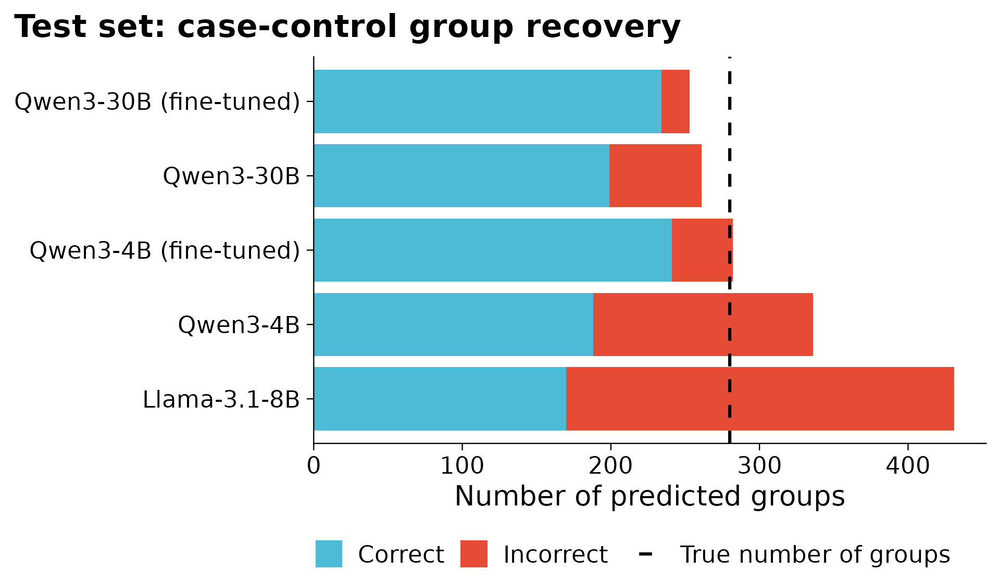
:::

::: {.pm-package .fragment .fade-up data-fragment-index="2"}
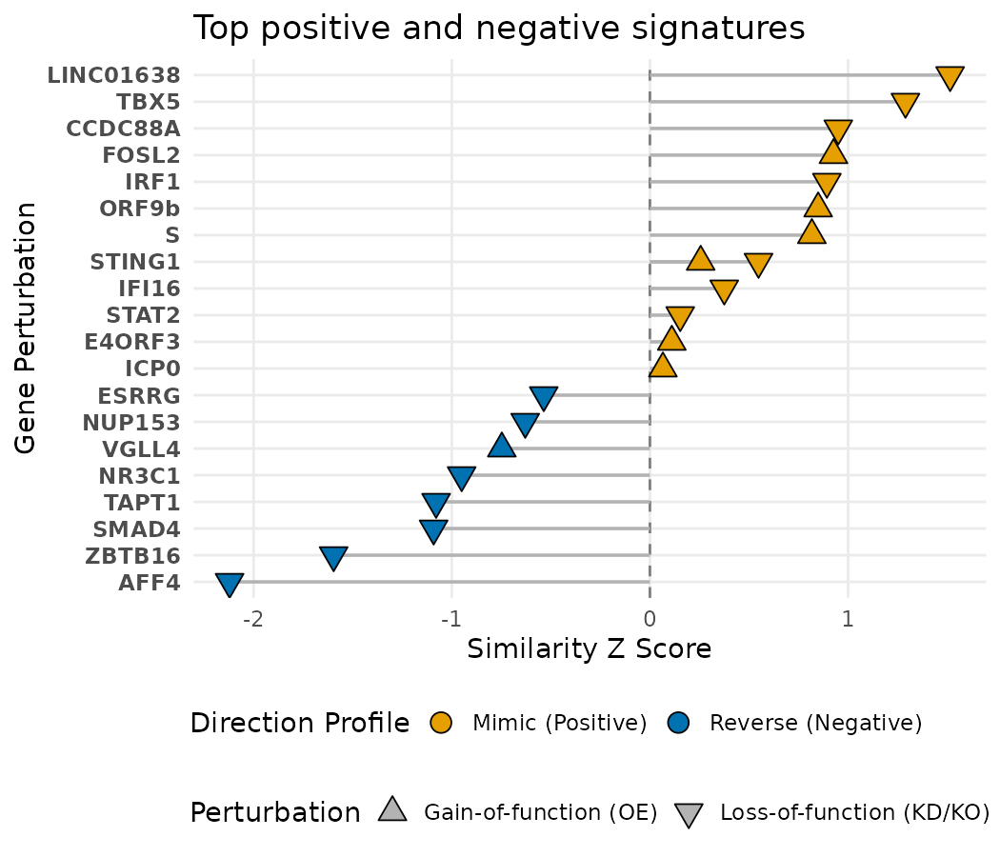
:::
::::

::::: {.column width="40%"}
**Fine-tune small local models**

-   Qwen3 4B and 30B, fine-tuned on 3,300 curated GEO series, on one GPU
-   Held-out test set, released after 2023: precision **0.925**, recall **0.836**
-   Small models without fine-tuning get many groups wrong (red)

:::: {.fragment .fade-up data-fragment-index="2"}
**perturbMatch**: give it your differential expression result, and it ranks the gene perturbations that mimic or reverse it.

::: chips
[6,802 signatures]{.chip} [4,453 GEO series]{.chip} [2,907 genes]{.chip}
:::
::::
:::::
::::::::
:::::::::
:::::::::::::::

::: cite
Soul & Young (2026) [bioRxiv 2026.08.08.743502](https://www.biorxiv.org/content/10.1101/2026.08.08.743502){target="_blank"}, Fig. 3B · [github.com/soulj/perturbMatch](https://github.com/soulj/perturbMatch){target="_blank"}
:::

##  What changes for us?

::::: columns
::: {.column width="48%"}
 **You**

-   ask the question
-   design the analysis
-   define what “correct” means
-   verify the result
-   decide when it's finished
-   defend the result
:::

::: {.column .fragment width="48%"}
 **LLM**

-   write the boilerplate
-   install and configure software
-   write/refactor the code
-   run tools
-   inspect errors
-   iterate
:::
:::::

::: {.big .fragment}
Your name is still on the paper.
:::

# 3. Prompting as a research skill {background-gradient="linear-gradient(to bottom, #25717D 0%, #25717D 85%, #FFFFFF 85%, #FFFFFF 100%)"}

##  Try it: write the prompt

You have an RNA-seq genes x sample counts matrix and a sample sheet: treated vs control, five replicates each.

::: big
What are the key points of a prompt to get an LLM to write the differential expression analysis code?
:::

##  Vague vs specified

::::::: columns
:::: {.column width="34%"}
::: panel
**Vague**

> Write me some R code to do differential expression.

You will get something, likely to be inefficient/incorrect.
:::
::::

:::: {.column width="62%"}
::: {.panel .fragment style="font-size: 0.78em"}
**Specified**

**Role** — bioinformatician working in R and Bioconductor.

**Task** — differential expression, treated vs control.

**Context** — counts in `counts.rds`, sample sheet attached, five replicates per group, batch in the `run` column.

**Constraints** — edgeR, not DESeq2. No new dependencies. Do not rename the gene IDs.

**Output** — one script, and list any packages it needs.

**Examples** — follow the structure of `previous_de.R`.

**Evaluation** — rows in and rows out at each step, and the number of genes at FDR \< 0.05.
:::
::::
:::::::

::: {.big .fragment}
When the output is bad, check for a missing part.
:::

##  What you know is important!

::::::: columns
::: {.column width="42%"}
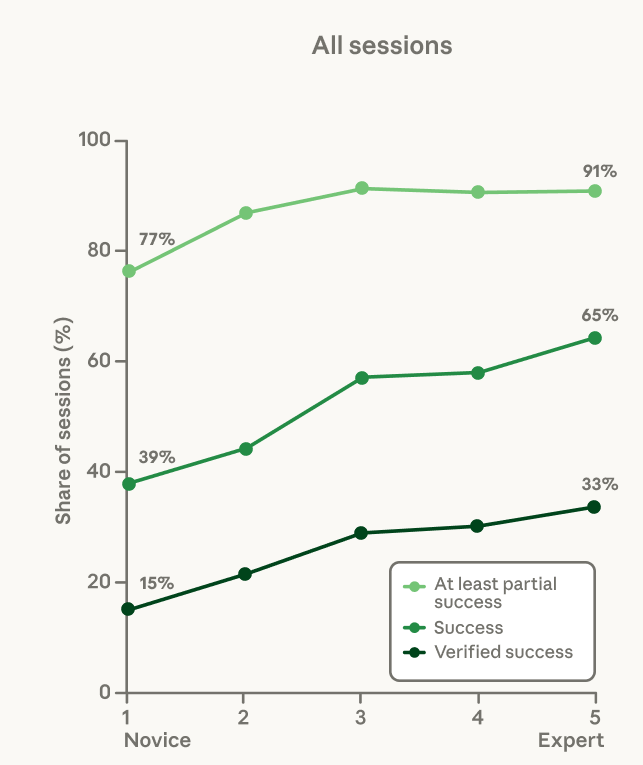{fig-align="center" style="height: 380px;"}
:::

::::: {.column width="56%"}
::: panel
Anthropic classified ~400,000 real Claude Code sessions by how expert the user was **at the task**, not at programming.

Verified success: **15%** of novice sessions, **28–33%** once the user is intermediate or better.
:::

::: fragment
Most of the gain is the novice  intermediate step. After that the curve flattens.
:::
:::::
:::::::

::: {.big .fragment style="margin: -0.8em 0 0"}
Your biology, your data science, your knowledge of the data.
:::

::: cite
Hitzig et al. (2026) *[Agentic coding and persistent returns to expertise](https://www.anthropic.com/research/claude-code-expertise){target="_blank"}*. Anthropic, Fig. 5 (left panel). \~400,000 sessions, \~235,000 users, October 2025 to April 2026.
:::

##  Expertise shows most when it goes wrong

::::::: columns
::: {.column width="63%"}
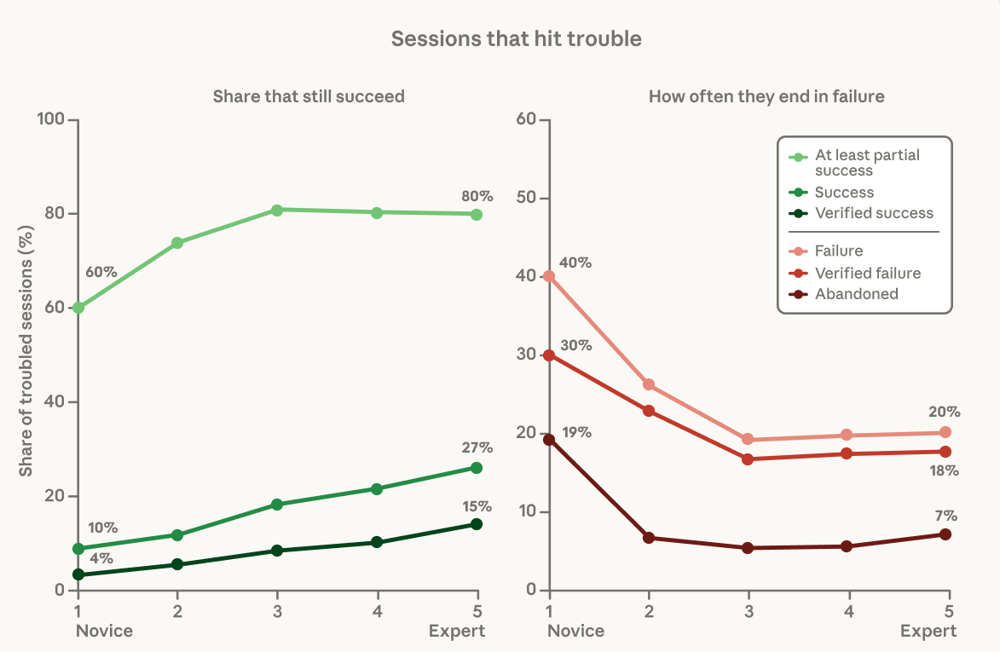{fig-align="center" style="height: 450px;"}
:::

::::: {.column width="35%"}
::: {.panel .fragment}
**Tell it what you know** — which packages we use, which ones are unreliable, what the output should look like, what goes wrong with this kind of dataset.
:::

::: {.big .fragment}
You are the expert driving the analysis, not Claude.
:::
:::::
:::::::

::: cite
[Hitzig et al. (2026)](https://www.anthropic.com/research/claude-code-expertise){target="_blank"}, Fig. 5 (middle and right panels). Sessions with more than three failure signals.
:::

# 4. Which model should I use? {background-gradient="linear-gradient(to bottom, #25717D 0%, #25717D 85%, #FFFFFF 85%, #FFFFFF 100%)"}

##  Do you need an LLM at all?

::::::: columns
::: {.column width="57%"}
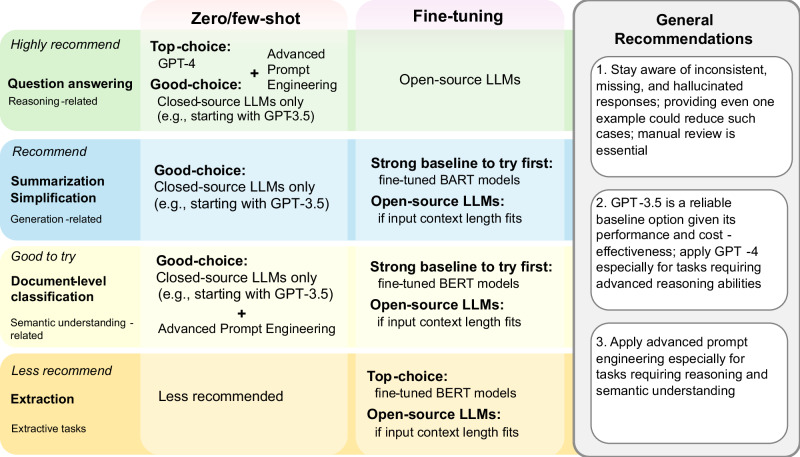
:::

:::: {.column width="41%"}
::: {.panel .fragment}
Macro-average, 12 BioNLP benchmarks, GPT-4-era models

| Approach                   | Score    |
|----------------------------|----------|
| **Fine-tuned BERT / BART** | **0.65** |
| LLM zero-shot              | 0.38     |
| LLM five-shot              | 0.48     |
| LLM fine-tuned             | 0.51     |
:::
::::

::: fragment
A fine-tuned BERT (\~100M parameters) beat LLMs hundreds of times its size on most extraction and classification tasks, and is far cheaper to run.
:::
:::::::

::: cite
Chen et al. (2025) *[Benchmarking large language models for biomedical natural language processing applications and recommendations](https://doi.org/10.1038/s41467-025-56989-2){target="_blank"}*. Nature Communications 16:3280, Fig. 4 and Table 2. CC BY.
:::

##  A leaderboard doesn't necessarily measure your task

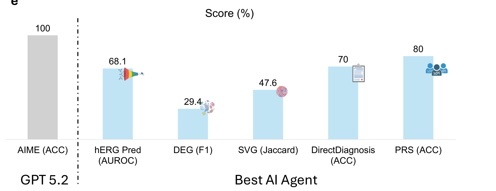{.r-stretch fig-align="center"}

::: {.big .fragment style="margin: 0.2em 0 0.1em;"}
100% at competition maths. 29% at finding DE genes.
:::

::: {.fragment .compact-quote}
> "Many agents encounter running issues when calling algorithms for batch-effect correction"
:::

::: fragment
Test your own examples
:::

::: cite
Liu et al. (2026) *Benchmarking AI Agents for Addressing Scientific Challenges Across Scales*. [arXiv:2606.12736](https://arxiv.org/abs/2606.12736){target="_blank"}, Fig. 1e. SciAgentArena, \~200 tasks.
:::

##  Running your own models

::::::: columns
::: {.column width="56%"}
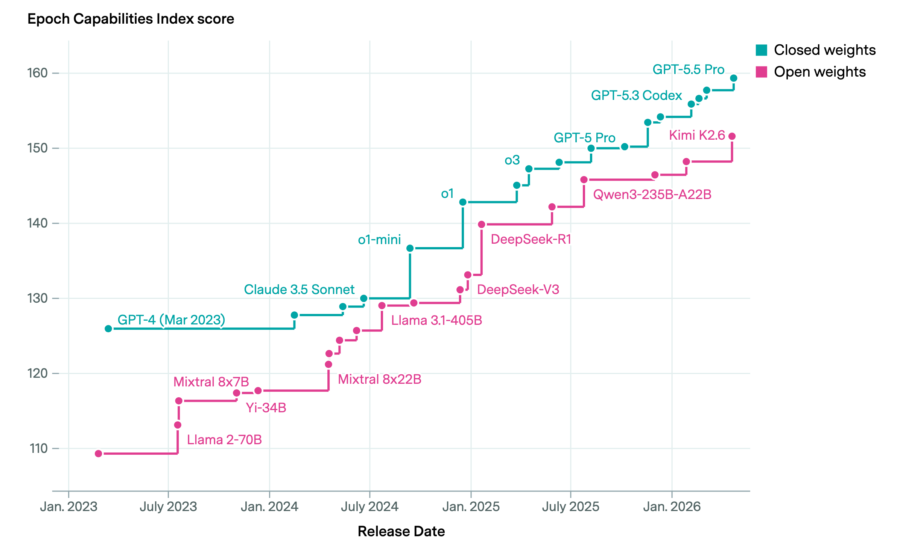{fig-align="center" width="100%"}
:::

::::: {.column width="42%"}
::: {.panel style="font-size: 0.8em"}
 **Reasons to run it yourself**

-   Identifiable data stays in-house (or use synthetic data)
-   Same model in five years
-   Big repetitive jobs, no bill per request
-   Repeatable: archivable weights
:::

::: {.panel .fragment style="font-size: 0.8em"}
 **Downsides**

-   Weaker on reasoning and code
-   Someone looks after the hardware
:::
:::::
:::::::

::: cite
Epoch AI (2026) *[Open models lag state-of-the-art closed models by 4 months](https://epoch.ai/data-insights/open-closed-eci-gap){target="_blank"}*
:::

# 5. Agentic AI {background-gradient="linear-gradient(to bottom, #25717D 0%, #25717D 85%, #FFFFFF 85%, #FFFFFF 100%)"}

##  Demo — Claude Code with a skill

::: claude-cast
:::

```{r}
#| echo: false
#| eval: true
#| results: asis
cat("```{=html}\n<script type=\"text/plain\" id=\"claude-cast-data\">\n")
cat(readLines("recordings/claude-demo.cast"), sep = "\n")
cat("</script>\n```\n")
```

```{=html}
<script>
window.addEventListener("load", function () {
  var cast = document.getElementById("claude-cast-data").textContent.trim();
  var root = document.querySelector(".reveal");
  var players = new Map();

  function onSlide() {
    var slide = Reveal.getCurrentSlide();
    players.forEach(function (player, holder) {
      if (!slide.contains(holder)) player.pause();
    });
    var holder = slide.querySelector(".claude-cast");
    root.classList.toggle("term-slide", !!holder);
    if (!holder || players.has(holder)) return;
    var player = AsciinemaPlayer.create({ data: cast }, holder, {
      fit: "both",
      idleTimeLimit: 3,
      pauseOnMarkers: true,
      controls: true,
      preload: true
    });
    players.set(holder, player);
    var marker = holder.dataset.marker;
    if (marker === undefined) {
      player.play();
    } else {
      player.seek({ marker: Number(marker) }).then(function () { player.play(); });
    }
  }

  Reveal.on("slidechanged", onSlide);
  onSlide();
});
</script>
```

##  What is an agent?

::: {.flow .tight}
prompt []{.arrow} [the model]{.solid}
:::

::::: fragment
::: {.flow .tight}
[]{.arrow}
:::

::: {.flow .tight}
  tools   memory   files
:::
:::::

::::: fragment
::: {.flow .tight}
[]{.arrow}
:::

::: {.flow .tight}
[execution loop]{.solid} [  and round again, until it stops]{.plain}
:::
:::::

::::: fragment
::: {.flow .tight}
[]{.arrow}
:::

::: {.flow .tight}
verification []{.arrow} a result you can check
:::
:::::

::: {.fragment style="margin-top: 1.4em"}
The **model** predicts tokens. The **harness** is everything else, and you can swap either.
:::

```{=html}
<div class="harnesses fragment">
  <div class="harness-group">
    <div class="harness-items">
      <span class="harness">Claude Code</span>
      <span class="harness">Codex</span>
      <span class="harness">Gemini CLI</span>
    </div>
    <div class="harness-label">one company's models</div>
  </div>
  <div class="harness-group">
    <div class="harness-items">
      <span class="harness">GitHub Copilot</span>
      <span class="harness">Cursor</span>
      <span class="harness">OpenCode</span>
    </div>
    <div class="harness-label">pick the model</div>
  </div>
</div>
```

##  Skills to enhance agents {.skill-slide}

A skill is a folder of Markdown telling the agent how **you** do something. Human readable, diffable, an open format.

```{=html}
<pre class="skill-head"><code>---
name: cbf-dataviz
description: CBF (Computational Biology Facility) house style and helper functions for scientific data visualisation in R/ggplot2. <b class="fragment skill-key trigger" data-fragment-index="1">Use whenever producing or reviewing a figure</b> for a CBF project - volcano plots, PCA, heatmaps, box/violin/beeswarm plots, Venn/UpSet, pathway dot plots, circos, MSA, protein domain diagrams - or when choosing a colour palette, picking a ggplot theme, preparing a publication-ready/multi-panel figure, or exporting figures for Inkscape/PowerPoint editing. <b class="fragment skill-key trigger" data-fragment-index="1">Trigger on "make a volcano plot", "plot the PCA", "heatmap of these genes", "colour palette for this project", "make this figure publication ready", "tidy up this ggplot"</b>, <b class="fragment skill-key trigger" data-fragment-index="1">even when CBF is not mentioned</b>.
---

# CBF data visualisation

<i class="skill-cut">[...]</i>
You already know ggplot2, what a volcano plot is, and that colour-blind-safe palettes matter.
<b class="fragment skill-key rule" data-fragment-index="2">**Don't re-explain any of that.**</b> This skill is <b class="fragment skill-key rule" data-fragment-index="2">only the things you would otherwise get wrong</b>:
the house defaults, the bundled function API, and the tacit workflow knowledge.

## The defaults - <b class="fragment skill-key rule" data-fragment-index="2">apply without being asked</b>
<i class="skill-cut">[...]</i>
- **Theme: `cowplot::theme_cowplot()`.** Use `smplot2::sm_hgrid()` if horizontal gridlines are
  genuinely needed. <b class="fragment skill-key rule" data-fragment-index="2">**Never ship ggplot2's default grey theme**</b> - it reads as amateurish.</code></pre>
```

::: term-hint
`cbf-dataviz/SKILL.md`, trimmed at \[...\]. Click through for [when to load it]{.skill-legend .trigger} then [the rules it must follow]{.skill-legend .rule}
:::

::: {.fragment fragment-index="3"}
> An SOP that happens to be machine-actionable.
:::

##  Demo — what did the agent do?

::: {.claude-cast data-marker="0"}
:::

::: {.fragment .cast-figure}
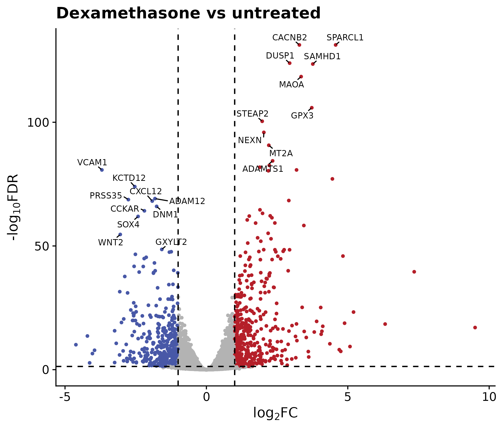{.nolightbox}
:::

##  A skill changes the output {visibility="uncounted"}

::::: columns
::: {.column width="48%"}
**Without the skill**

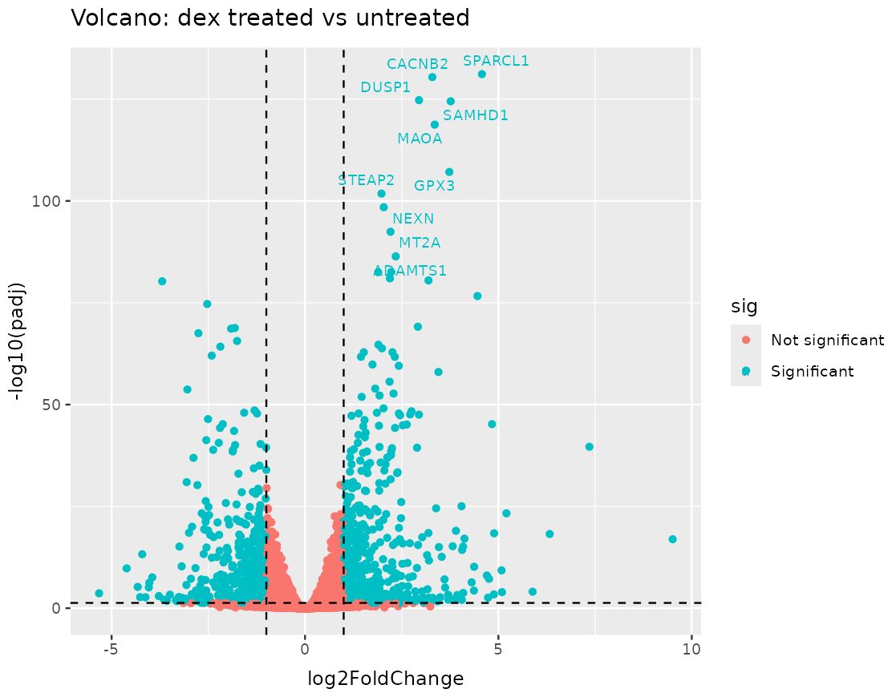{fig-align="center" width="100%"}
:::

::: {.column .fragment width="48%"}
**With the CBF visualisation skill**

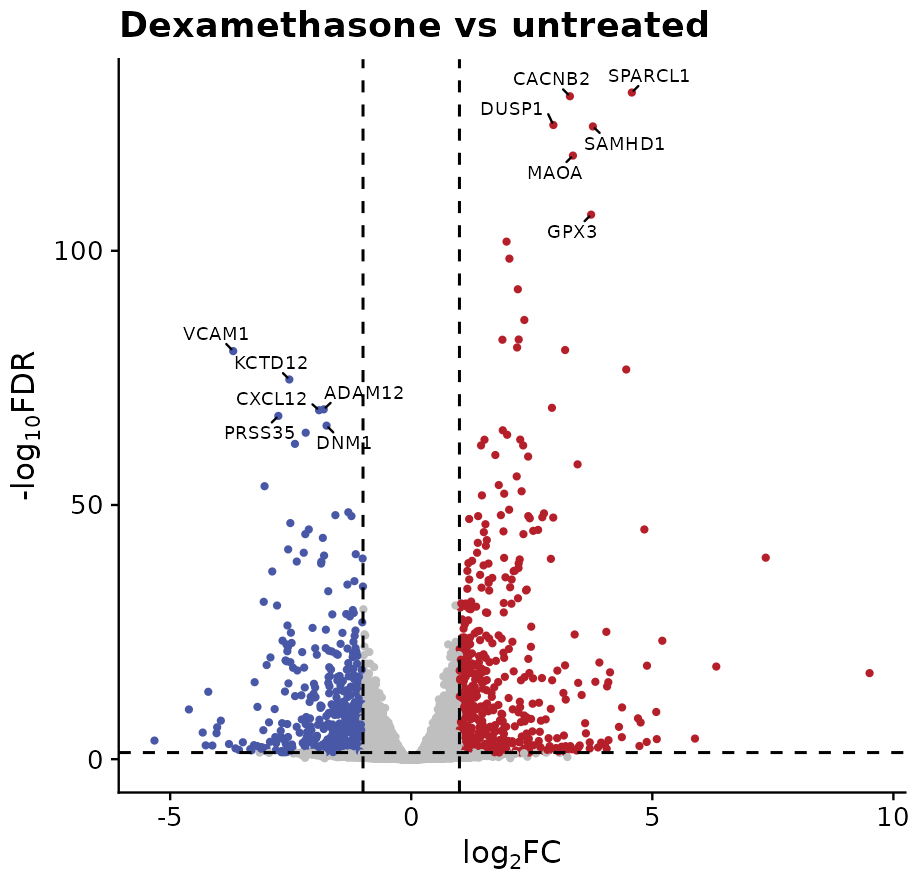{fig-align="center" width="100%"}
:::
:::::

::: {.big .fragment}
The model writes the code. The skill supplies the local rules.
:::

##  Let the agent run — efficiently

::: {.flow .large}
git commit []{.arrow} [let it run]{.solid} []{.arrow} git diff []{.arrow} keep, or git checkout []{.arrow} git commit
:::

::::::: columns
:::: {.column width="48%"}
::: {.panel .fragment}
 **One task per session**

A fresh session carries no stale context
:::
::::

:::: {.column width="48%"}
::: {.panel .fragment}
 **What it reads can give it orders**

A file or web page can hide instructions

A package name it made up may have been registered by someone else
:::
::::
:::::::

# 6. How it goes wrong {background-gradient="linear-gradient(to bottom, #25717D 0%, #25717D 85%, #FFFFFF 85%, #FFFFFF 100%)"}

##  What can go wrong

```{=html}
<table class="row-fragments">
  <colgroup><col style="width: 32%"><col style="width: 68%"></colgroup>
  <thead>
    <tr><th>Task</th><th>Watch out for</th></tr>
  </thead>
  <tbody>
    <tr class="fragment"><td>Suggest search terms for a literature search</td><td>You only see the papers it found, so gaps are easy to miss</td></tr>
    <tr class="fragment"><td>Find references for a claim</td><td>Made-up citations: over 140,000 in 2025 papers and preprints. With search, it can still put a real paper on a claim it made up</td></tr>
    <tr class="fragment"><td>Explain this code to me</td><td>You can’t check the explanation, and it sounds as sure when it’s wrong</td></tr>
    <tr class="fragment"><td>Write this script</td><td>The script runs and the numbers are wrong, say from a flipped comparison or samples out of order</td></tr>
    <tr class="fragment"><td>Interpret this result</td><td>A wrong answer can read like a right one</td></tr>
  </tbody>
</table>
```

::: {.big .fragment}
Before you rely on it, ask how you'd know if it were wrong.
:::

::: cite
Made-up citations: Nature News, [8](https://www.nature.com/articles/d41586-026-00748-w){target="_blank"} and [14 May 2026](https://www.nature.com/articles/d41586-026-01545-1){target="_blank"}
:::

##  Spot the problem

::::::: columns
::: {.column width="64%"}
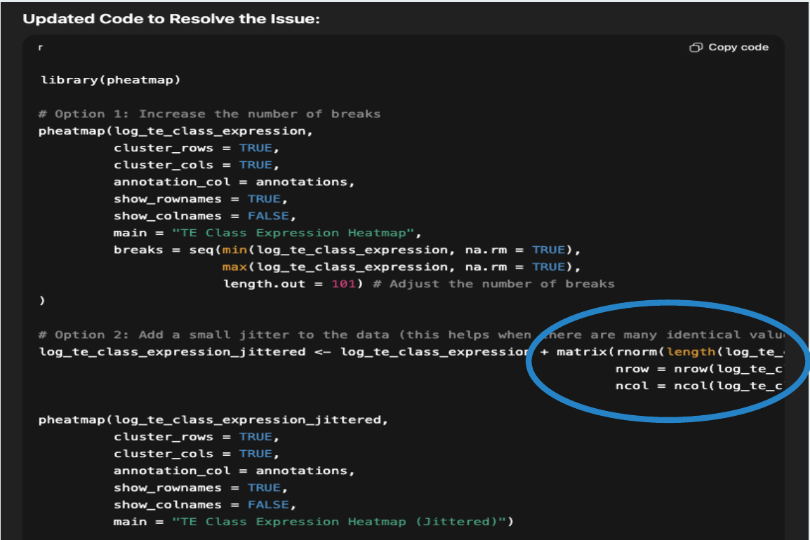{style="max-height: 440px;"}
:::

::::: {.column width="34%"}
An AI's fix for a heatmap that wouldn't draw.

::: {.big .fragment}
adds random noise to the data.
:::

::: {.fragment style="font-size: 0.7em"}
**Other fixes that "work"**

-   Edits the test until it passes
-   Hard-codes the expected output
-   Loosens the threshold
-   Silently drops IDs that didn't map
:::
:::::
:::::::

::: {.big .fragment}
Look at the code, not just the output!
:::

::: cite
Example from Mohab Helmy, *Prompting for biologists* (University of Cambridge), via Ana Mariya Anhel
:::

##  Do I get the right answer each time?

[**BioMysteryBench:** 99 expert-set problems on real data, with answers that can be checked. Each run five times per model.]{style="font-size: 0.7em"}

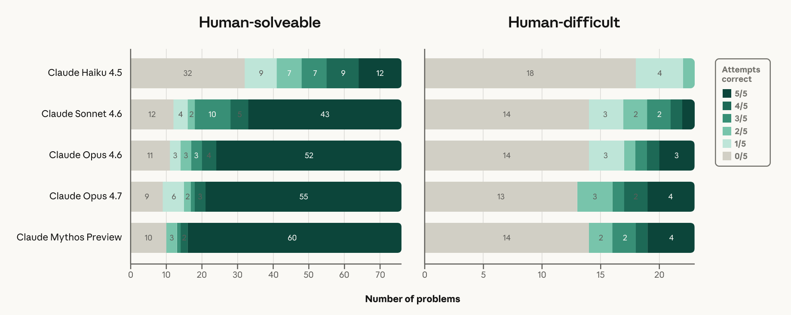{.r-stretch fig-align="center"}

::: {.big .fragment}
Most right answers came from 1 run in 5
:::

::: {.cite style="margin-bottom: 40px"}
Anthropic (2026) *[Evaluating Claude's bioinformatics research capabilities with BioMysteryBench](https://www.anthropic.com/research/Evaluating-Claude-For-Bioinformatics-With-BioMysteryBench){target="_blank"}*, Fig. 3
:::

# 7. Take homes {background-gradient="linear-gradient(to bottom, #25717D 0%, #25717D 85%, #FFFFFF 85%, #FFFFFF 100%)"}

##  Four tips to take away

1.   Split it up. Break the analysis into cheap-to-check steps.
2.   Ground it. Give it your code, data, tools and known answers.
3.   Verify it. Test on your own examples. The risk depends on how easily you'd spot an error.
    -   Have a known answer? Keep a small gold-standard test and run it every time.
    -   Test the pieces and check the intermediate results.
4.   Record it. Keep your prompts with your code, and declare it when you publish.
    -   Model, version and date, what it did, how you checked it. Check the journal/funder rules each time.

##  Where is this going?

::::: columns
::: {.column width="52%"}
[The length of task agents can finish is doubling about every 4 months]{style="font-size: 0.7em"}

{fig-align="center" width="100%"}
:::

::: {.column .fragment width="46%"}
[Multistep genomics problems: the best model solves 31.5%]{style="font-size: 0.7em"}

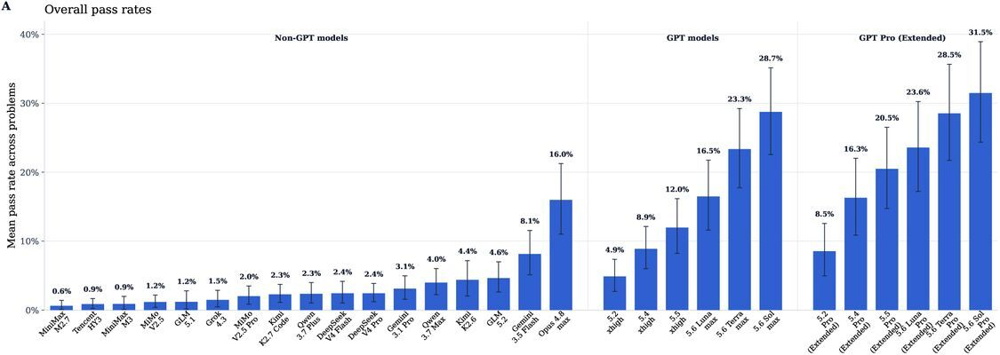{fig-align="center" width="100%"}
:::
:::::

::: {.big .fragment}
Fast progress, but important to remain cynical about outputs!
:::

::: cite
Kwa, West et al. (2025) *Measuring AI Ability to Complete Long Tasks*. METR. [arXiv:2503.14499](https://arxiv.org/abs/2503.14499){target="_blank"} · Li & Ho (2026) *GeneBench-Pro*. [bioRxiv 2026.06.29.735386](https://www.biorxiv.org/content/10.1101/2026.06.29.735386){target="_blank"}, Fig. 5A. 129 multistage problems.
:::

##  Where to go next

-    [Ana's course](https://zenodo.org/records/21653721): prompting, writing, declaring AI use, and what not to hand over
-    The Anthropic, OpenAI and Google prompting guides
-    Try out a local model: [Ollama](https://ollama.com) to run it, [ellmer](https://ellmer.tidyverse.org) to drive it from R
-    Consider trying an agentic LLM: Claude Code, Codex, Gemini CLI or OpenCode
-    Skills repos e.g [GPTomics/bioSkills](https://github.com/GPTomics/bioSkills)
-    Come and talk to us

::: {style="font-size: 0.75em"}
Reading: Meng et al. (2026) *[Large language models in bioinformatics: a comprehensive survey](https://doi.org/10.3389/fgene.2026.1797863){target="_blank"}*, Front. Genet. 17 · Wang et al. (2025) *Large Language Models in Bioinformatics: A Survey*, [arXiv:2503.04490](https://arxiv.org/abs/2503.04490){target="_blank"} · Lu et al. (2024) *The AI Scientist*, [arXiv:2408.06292](https://arxiv.org/abs/2408.06292){target="_blank"}
:::
